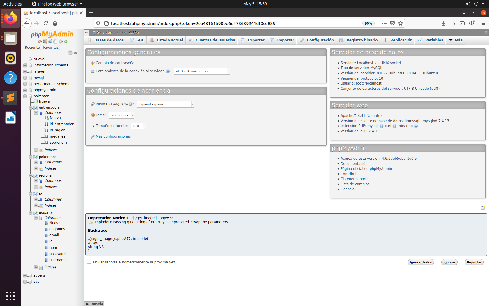
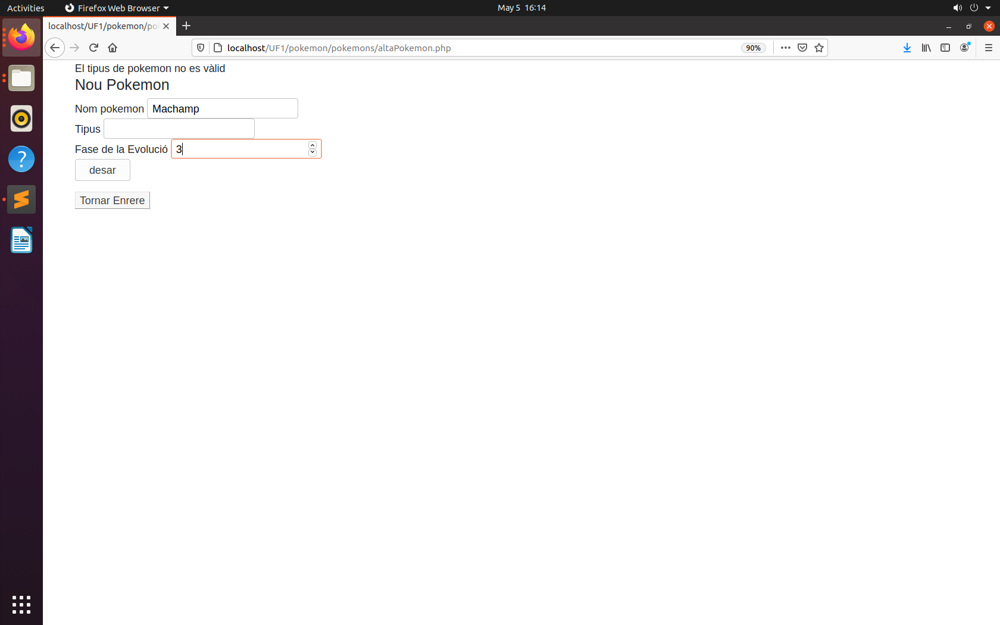

# Projecte Pokemon Aplicació Web Entorn Servidor
M3:UF6 - Introducció a lapersistència en BD 
M7:UF1 - Generació dinàmica depàgines web 

Professor: Ramon Cervera 
Alumne: Victor Porras Carrasco 
Curs: DAW1A 

## Índex

### 1-Descripció del projecte 
### 2-Diagrama E-R 
### 3-Model Relacional 
### 4-CRUD online de totes les taules 
### 5-Aplicació navegable a través de menú 
### 6-CSS Bootstrap 
### 7-Validació de les dades  
### 8-Validació d’usuaris 
### 9-Repoblament de formularis  

### 1-Descripció del projecte 

He dut a terme la creació d’una aplicació, per gestionar informació referent als registres dels pokemon amb el gestor de base dades "MySQL" phpMyAdmin. Per mitjà del framework Laravel en llegnuatge PHP. 

El projecte té com a objectiu crear l'aplicació "Pokemon". Per mitjà d'aquesta es gestionarà la funcionalitat web. 

Aquesta permet l'accès a la base de dades i està relacionada amb les diferents relacions. M a N, 1 a N. 

Es pot gestionar la informacio de les diferents entitats, realitzant el CRUD en cadasacuna. 

Es poden crear, actualitzar i eliminar registres en la base de dades de "Pokemon". 

### 2-Diagrama E-R 
 

Relació M a N: Pokemon amb Entrenador, molts pokemons poden tenir entrenadors i molts entrenadors poden tenir molts pokemons. 
Relació 1 a N: Regió amb Entrenador, en una regió pertanyen molts entrenadors i molts entrenadors pertanyen a una regió. 

### 3-Model Relacional 

- Pokemon (id_pokemon, nom, tipus). 
- Entrenador (id_entrenador, nom, nº medalles, id_regió). 
- Regió (id_regió, nom, clima). 
- Té (id_entrenador, id_pokemon) 
&nbsp;&nbsp;&nbsp;&nbsp;On id_entrenador és clau forana de Entrenador. 
&nbsp;&nbsp;&nbsp;&nbsp;On id_pokemon és clau forana de Pokemon. 
- Usuari (id_usuari, nom, cognoms, email, username, password) 

### 4-CRUD online de totes les taules 
A continuació foto de les taules, vista desde phpMyAdmin: 
 
Vista del CRUD de la taula Pokemons: 
 
Vista del CRUD de la taula Usuaris: 
 
Vista del CRUD de la taula Regions: 
 
Vista del CRUD de la taula Entrenadors: 
En aquesta vista tenim la unio del 1 a N el id_regio foreign key passa a la taula Entrenadors, per tant hi ha per establir la relacio Entrenador amb la columna nom (atribut) de la regio.
 
Vista del CRUD de la taula "te" M a N: 
En aquesta vista tenim la unió de la relació M a N Pokemons amb entrenadors, les dos foreing keys id_entrenador i id_pokemon.
 

### 5-Aplicació navegable a través de menú 
S'ha implementat un menú navegable desde totes les pàgines amb l'opció també de retornar a la pàgina anterior a la vista. 
[Menu](https://github.com/VictorPorrasWork/Victor_M7_pokemon/blob/main/pokemon/menu.php)
 
### 6-CSS Bootstrap 
He aplicat estils amb CSS als titols, taula, p, links i botons. 
[CSS-Estils](https://github.com/VictorPorrasWork/Victor_M7_pokemon/blob/main/pokemon/menu.php)
 
### 7-Validació de les dades  
Totes les taules contenten regles de validacions per a la cumplementació dels forumlaris. 
En aquest cas introduïm a la taula pokemons un pokemon amb el nom d'un tipus que està mal escrit/no existeix. 
Llavors en surt el warming de validació que el tipus no es vàlid.  
Les regles de validacions s'han implementat per mitjà de try catch. 
 
 
Ara hem possat l'exemple en el que l'usuari omplena el formulari pero no ha possat bé el format del mail "x@xcom". 
 

### 8-Validació d’usuaris 
Si no s'està validat com a usuari no hi ha accès a cap de les opcions de la navegacio del menú. 
 

### 9-Repoblament de formularis 
S'ha implementat repoblament d'usuaris per mitja de la funció isset(), per saber també si una variable està definida i no es NULL. 
Aquí un exemple per introduïr l'alta d'un pokemon amb la funció isset en tots els seus atributs.
[pokemon-repoblament](https://github.com/VictorPorrasWork/Victor_M7_pokemon/blob/main/pokemon/pokemons/altaPokemon.php) 

